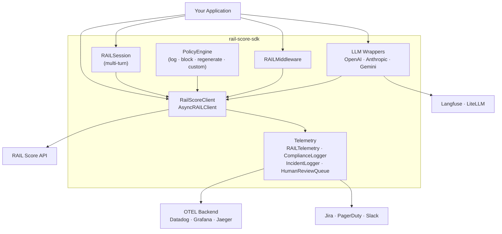
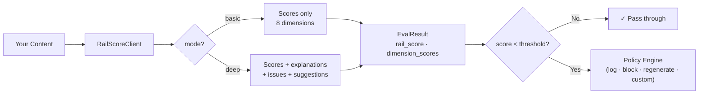
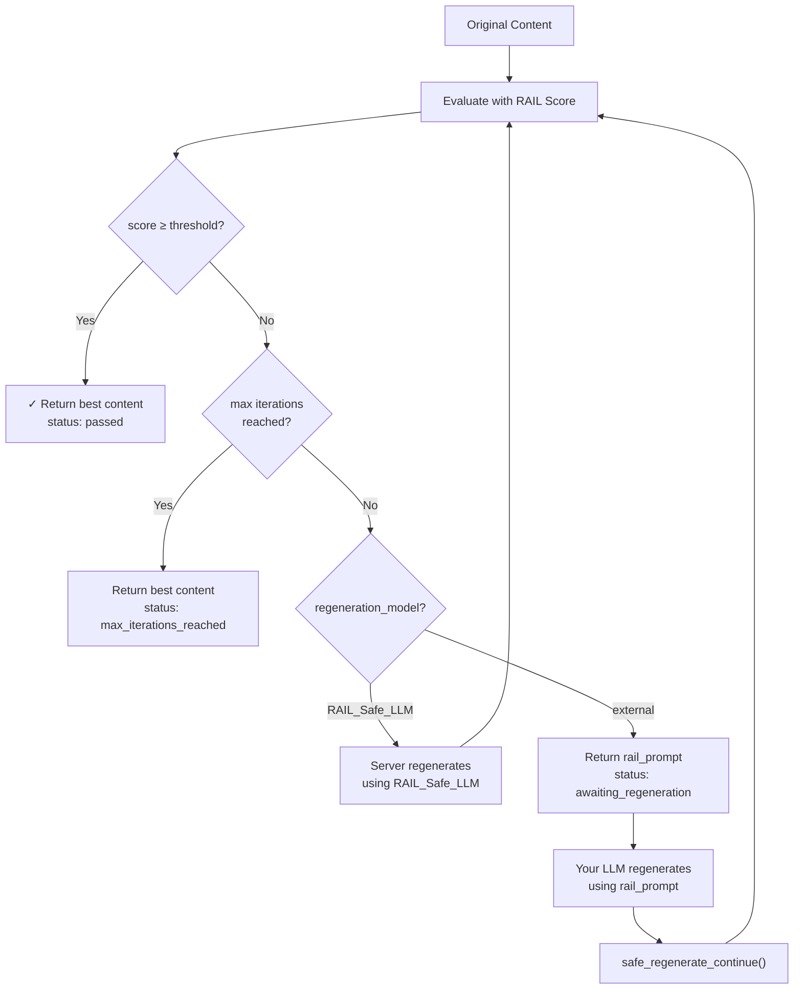
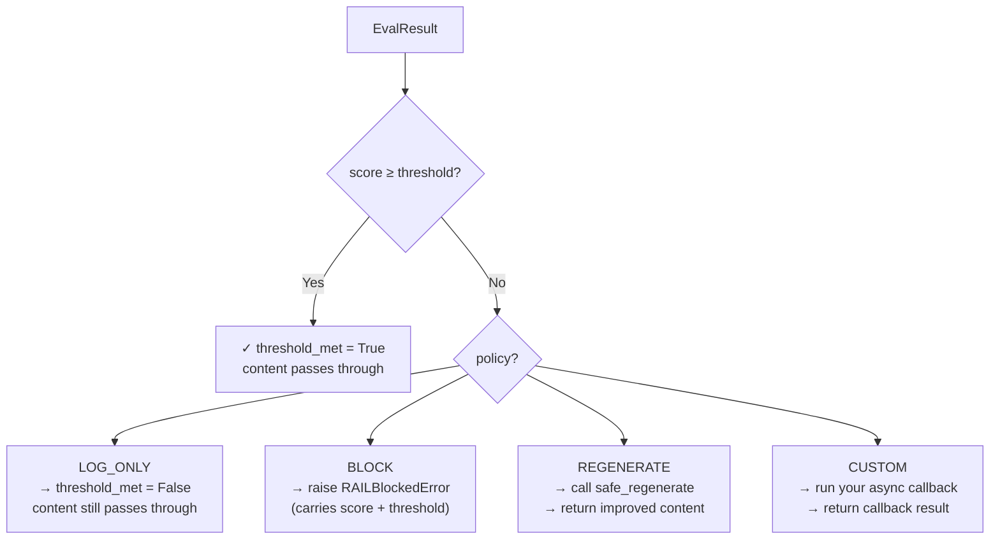
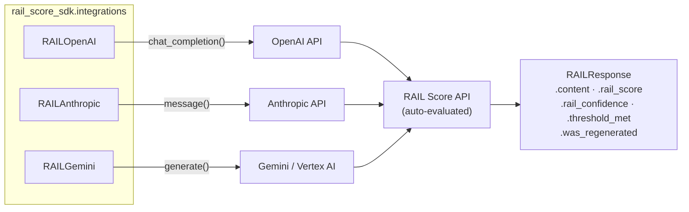
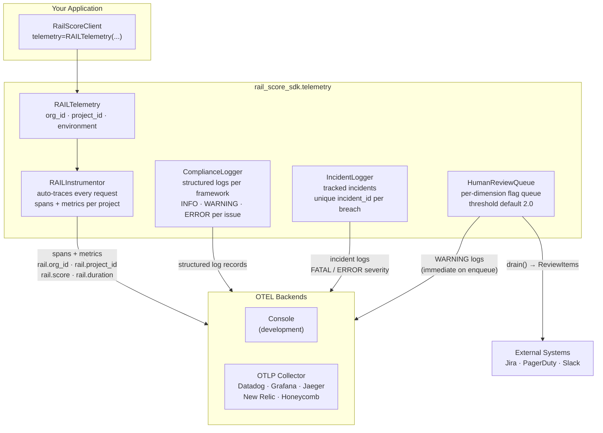
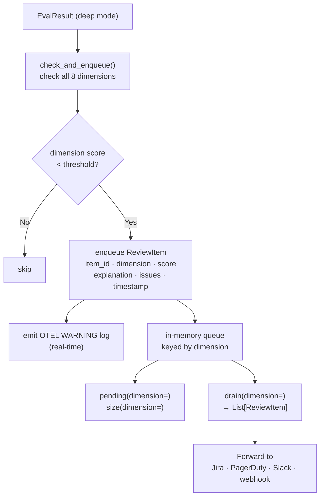

# RAIL Score Python SDK

Official Python client library for the [RAIL Score API](https://responsibleailabs.ai/developer/api-reference) — evaluate AI-generated content across 8 dimensions of Responsible AI.

[](https://pypi.org/project/rail-score-sdk/)
[](https://www.python.org/downloads/)
[](https://opensource.org/licenses/MIT)

---

## Table of Contents

- [Architecture](#architecture)
- [Quick Start](#quick-start)
- [Installation](#installation)
- [Evaluation](#evaluation)
- [Safe Regeneration](#safe-regeneration)
- [Compliance Checking](#compliance-checking)
- [Policy Engine](#policy-engine)
- [Multi-Turn Sessions](#multi-turn-sessions)
- [Middleware](#middleware)
- [LLM Provider Integrations](#llm-provider-integrations)
- [OpenTelemetry Observability](#opentelemetry-observability)
- [Observability Integrations](#observability-integrations)
- [RAIL Dimensions](#rail-dimensions)
- [Error Handling](#error-handling)
- [Examples](#examples)

---

## Architecture

The SDK sits between your application and the RAIL Score API, providing sync/async clients, policy enforcement, LLM provider wrappers, and a full OpenTelemetry observability stack.



---

## Quick Start

```bash
pip install rail-score-sdk
```

```python
from rail_score_sdk import RailScoreClient

client = RailScoreClient(api_key="your-api-key")

result = client.eval("AI should be transparent and fair.", mode="basic")

print(f"RAIL Score: {result.rail_score.score}/10")
for dim, ds in result.dimension_scores.items():
    print(f"  {dim}: {ds.score}/10")
```

---

## Installation

```bash
# Core SDK
pip install rail-score-sdk

# LLM provider wrappers
pip install "rail-score-sdk[openai]"
pip install "rail-score-sdk[anthropic]"
pip install "rail-score-sdk[google]"

# OpenTelemetry observability
pip install "rail-score-sdk[telemetry]"

# Observability integrations
pip install "rail-score-sdk[langfuse]"
pip install "rail-score-sdk[litellm]"

# Everything
pip install "rail-score-sdk[integrations]"
```

| Extra | What it installs |
|-------|-----------------|
| `openai` | `openai` async client |
| `anthropic` | `anthropic` async client |
| `google` | `google-genai` + Vertex AI support |
| `telemetry` | `opentelemetry-api/sdk` + OTLP exporters |
| `langfuse` | `langfuse>=3.0` |
| `litellm` | `litellm>=1.40` |
| `integrations` | All of the above |

---

## Evaluation

Score any text across all 8 RAIL dimensions. Two modes:

| Mode | Speed | Output |
|------|-------|--------|
| `basic` | Fast | Overall score + per-dimension scores |
| `deep` | Detailed | + per-dimension explanations, issues, improvement suggestions |

### How evaluation works



### Sync client

```python
from rail_score_sdk import RailScoreClient

client = RailScoreClient(api_key="your-api-key")

# Basic mode — fast, all 8 dimensions
result = client.eval(
    content="Your content here",
    mode="basic",
    domain="healthcare",    # general · healthcare · finance · legal · education · code
    usecase="chatbot",      # general · chatbot · content_generation · summarization · code_generation
)
print(f"Score: {result.rail_score.score}/10  ({result.rail_score.summary})")

# Deep mode — explanations, issues, suggestions
result = client.eval(
    content="Your content here",
    mode="deep",
    dimensions=["safety", "privacy", "reliability"],  # subset of 8
    include_explanations=True,
    include_issues=True,
    include_suggestions=True,
)
for dim, ds in result.dimension_scores.items():
    print(f"  {dim}: {ds.score}/10 — {ds.explanation}")

# Custom dimension weights (must sum to 100)
result = client.eval(
    content="Your content here",
    weights={
        "safety": 30, "reliability": 20, "privacy": 15,
        "fairness": 10, "transparency": 10, "accountability": 5,
        "inclusivity": 5, "user_impact": 5,
    },
)
```

### Async client

```python
import asyncio
from rail_score_sdk import AsyncRAILClient

async def main():
    async with AsyncRAILClient(api_key="your-api-key") as client:
        result = await client.eval("Your content here", mode="basic")
        print(f"Score: {result['rail_score']['score']}/10")

        # Built-in caching (5-min TTL) — second identical call is instant
        result2 = await client.eval("Your content here", mode="basic")
        print(f"From cache: {result2.get('from_cache')}")

        # Concurrent evaluation
        import asyncio
        results = await asyncio.gather(
            *[client.eval(text, mode="basic") for text in texts]
        )

asyncio.run(main())
```

---

## Safe Regeneration

Evaluate content and automatically iterate until it meets your quality threshold.



### Server-side mode (RAIL_Safe_LLM)

The API handles the regeneration loop server-side. Simplest option.

```python
result = client.safe_regenerate(
    content="Content to improve",
    regeneration_model="RAIL_Safe_LLM",
    max_regenerations=3,
    thresholds={"overall": {"score": 7.0}},
    domain="general",
)

print(f"Status:  {result.status}")          # passed / max_iterations_reached
print(f"Content: {result.best_content}")
print(f"Credits: {result.credits_consumed}")
```

### External mode (your own LLM)

The API returns a structured prompt; you regenerate with your own model and continue the session.

```python
# Step 1: Start session, get the rail_prompt
result = client.safe_regenerate(
    content="Content to check",
    regeneration_model="external",
    thresholds={"overall": {"score": 7.0}},
)

if result.status == "awaiting_regeneration":
    # Step 2: Regenerate with your own model using result.rail_prompt
    improved = my_llm(result.rail_prompt.system_prompt, result.rail_prompt.user_prompt)

    # Step 3: Continue the session
    result = client.safe_regenerate_continue(
        session_id=result.session_id,
        regenerated_content=improved,
    )
```

---

## Compliance Checking

Evaluate content against regulatory frameworks.

**Supported frameworks:** `gdpr` · `ccpa` · `hipaa` · `eu_ai_act` · `india_dpdp` · `india_ai_gov`

```python
# Single framework
result = client.compliance_check(
    content="Our AI processes user health records automatically...",
    framework="gdpr",
    context={
        "domain": "healthcare",
        "data_types": ["health_records", "genetic_data"],
    },
)

print(f"Score:  {result.compliance_score.score}/10  ({result.compliance_score.label})")
print(f"Passed: {result.requirements_passed}/{result.requirements_checked}")

for issue in result.issues:
    print(f"  [{issue.severity}] {issue.description}  →  {issue.article}")

# Multi-framework (up to 5 at once)
result = client.compliance_check(
    content="...",
    frameworks=["gdpr", "ccpa", "hipaa"],
)
summary = result.cross_framework_summary
print(f"Average: {summary.average_score}/10  Weakest: {summary.weakest_framework}")

# Strict mode (raises threshold from 7.0 → 8.5)
result = client.compliance_check(content="...", framework="eu_ai_act", strict_mode=True)
```

---

## Policy Engine

Controls what happens when a response scores below your threshold.



```python
import asyncio
from rail_score_sdk import AsyncRAILClient, PolicyEngine, Policy, RAILBlockedError

async def main():
    async with AsyncRAILClient(api_key="your-api-key") as client:
        eval_response = await client.eval(content="Some content", mode="basic")

        # LOG_ONLY — always passes, attaches score metadata
        engine = PolicyEngine(policy=Policy.LOG_ONLY, threshold=7.0)
        result = await engine.enforce("Some content", eval_response, client)

        # BLOCK — raises RAILBlockedError if score < threshold
        engine = PolicyEngine(policy=Policy.BLOCK, threshold=7.0)
        try:
            await engine.enforce("Some content", eval_response, client)
        except RAILBlockedError as e:
            print(f"Blocked — score={e.score}, threshold={e.threshold}")

        # REGENERATE — auto-improves content via safe_regenerate
        engine = PolicyEngine(policy=Policy.REGENERATE, threshold=7.0)
        result = await engine.enforce("Some content", eval_response, client)
        if result.was_regenerated:
            print(f"Improved: {result.content}")

        # CUSTOM — run any async callback
        async def my_handler(content, eval_data, rail_client):
            return "Custom improved content"

        engine = PolicyEngine(policy=Policy.CUSTOM, threshold=7.0, custom_callback=my_handler)
        result = await engine.enforce("Some content", eval_response, client)

asyncio.run(main())
```

---

## Multi-Turn Sessions

`RAILSession` tracks conversation history and applies RAIL evaluation per turn with adaptive quality gating.

```python
import asyncio
from rail_score_sdk import RAILSession

async def main():
    async with RAILSession(
        api_key="your-api-key",
        threshold=7.0,
        policy="regenerate",   # auto-regenerate low-scoring responses
        mode="basic",
        domain="healthcare",
        deep_every_n=5,        # force deep eval every 5th turn
        context_window=3,      # include last 3 turns as context
    ) as session:

        result = await session.evaluate_turn(
            user_message="What medication for a headache?",
            assistant_response="Take 500mg ibuprofen every 4-6 hours with food.",
        )
        print(f"Turn 1 — score={result.score:.1f}")

        # Pre-screen user input without recording a turn
        check = await session.evaluate_input("How do I harm someone?")
        if not check.threshold_met:
            print(f"Unsafe input — score={check.score:.1f}")

        # Session metrics
        print(session.scores_summary())
        # {'total_turns': 1, 'average_score': 8.2, 'lowest_score': 8.2,
        #  'turns_below_threshold': 0, 'regenerations': 0}

asyncio.run(main())
```

---

## Middleware

`RAILMiddleware` wraps any async LLM generate function with transparent RAIL evaluation and policy enforcement.

```python
import asyncio
from rail_score_sdk import RAILMiddleware

async def my_llm(messages, **kwargs):
    return "The LLM response."

async def main():
    mw = RAILMiddleware(
        api_key="your-rail-api-key",
        generate_fn=my_llm,
        threshold=7.0,
        policy="block",
        mode="basic",
        eval_input=True,       # also safety-check the user's input
        input_threshold=5.0,
    )

    result = await mw.run(messages=[
        {"role": "system", "content": "You are a helpful assistant."},
        {"role": "user", "content": "Explain quantum computing."},
    ])
    print(f"Score: {result.score}  Threshold met: {result.threshold_met}")

asyncio.run(main())
```

---

## LLM Provider Integrations

Drop-in wrappers that automatically evaluate every LLM response via RAIL Score.



### OpenAI

```bash
pip install "rail-score-sdk[openai]"
```

```python
from rail_score_sdk.integrations import RAILOpenAI

client = RAILOpenAI(
    openai_api_key="sk-...",
    rail_api_key="your-rail-api-key",
    rail_threshold=7.0,
    rail_policy="regenerate",
    rail_mode="basic",
)

response = await client.chat_completion(
    model="gpt-4o",
    messages=[{"role": "user", "content": "Explain quantum computing."}],
)
print(f"Score: {response.rail_score}/10  Regenerated: {response.was_regenerated}")
```

### Anthropic

```bash
pip install "rail-score-sdk[anthropic]"
```

```python
from rail_score_sdk.integrations import RAILAnthropic

client = RAILAnthropic(
    anthropic_api_key="sk-ant-...",
    rail_api_key="your-rail-api-key",
    rail_threshold=7.0,
    rail_policy="block",
)

response = await client.message(
    model="claude-sonnet-4-5-20250929",
    max_tokens=1024,
    messages=[{"role": "user", "content": "Explain quantum computing."}],
)
print(f"Score: {response.rail_score}/10")
```

### Google Gemini

```bash
pip install "rail-score-sdk[google]"
```

```python
from rail_score_sdk.integrations import RAILGemini

# Gemini API key
client = RAILGemini(
    gemini_api_key="AIza...",
    rail_api_key="your-rail-api-key",
    rail_threshold=7.0,
    rail_policy="log_only",
)

# Vertex AI
client = RAILGemini(
    rail_api_key="your-rail-api-key",
    vertexai=True,
    project="my-gcp-project",
    location="us-central1",
    rail_threshold=7.0,
)

response = await client.generate(model="gemini-2.5-flash", contents="...")
print(f"Score: {response.rail_score}/10")
```

---

## OpenTelemetry Observability

```bash
pip install "rail-score-sdk[telemetry]"
```

Vendor-neutral observability using the OpenTelemetry standard. Every API call is automatically traced and metered once you pass a `RAILTelemetry` instance to the client — no other code changes needed.

### Telemetry pipeline



### Setup

```python
from rail_score_sdk import RailScoreClient
from rail_score_sdk.telemetry import RAILTelemetry

# Development — console exporter
telemetry = RAILTelemetry(
    org_id="acme-corp",
    project_id="customer-chatbot",
    environment="production",
    exporter="console",
)

# Production — OTLP (Datadog, Grafana, Jaeger, etc.)
telemetry = RAILTelemetry(
    org_id="acme-corp",
    project_id="customer-chatbot",
    environment="production",
    exporter="otlp",
    endpoint="localhost:4317",
    protocol="grpc",           # or "http"
    headers={"Authorization": "Bearer <token>"},
)

client = RailScoreClient(api_key="rail_xxx", telemetry=telemetry)
# Every call now emits spans, metrics, and logs automatically
```

Automatically emitted per request:
- **Span** — `RAIL POST /railscore/v1/eval` with `rail.score`, `rail.confidence`, `rail.mode`, `rail.project_id`, `rail.org_id`
- **Counters** — `rail.requests`, `rail.errors`, `rail.credits.consumed`
- **Histograms** — `rail.request.duration`, `rail.score.distribution`

### Multi-project scoping

Each `RAILTelemetry` instance is fully isolated — providers are not shared. `rail.org_id` and `rail.project_id` are first-class span and metric attributes (not just resource attributes), so you can filter per project directly in any OTEL backend dashboard.

```python
telemetry_chatbot = RAILTelemetry(org_id="acme", project_id="chatbot-v2", exporter="otlp", ...)
telemetry_search  = RAILTelemetry(org_id="acme", project_id="search-api",  exporter="otlp", ...)

client_chatbot = RailScoreClient(api_key=KEY, telemetry=telemetry_chatbot)
client_search  = RailScoreClient(api_key=KEY, telemetry=telemetry_search)
# All traces and metrics are independently scoped per project
```

### ComplianceLogger

Emit structured OTEL log records for compliance check results with per-issue severity tagging.

```python
from rail_score_sdk.telemetry import ComplianceLogger

comp_logger = ComplianceLogger(telemetry)

# Single framework — emits INFO summary + WARNING/ERROR per issue
result = client.compliance_check(content="...", framework="gdpr")
comp_logger.log_compliance_result(result)

# Multi-framework — cross-framework summary + per-framework logs
multi = client.compliance_check(content="...", frameworks=["gdpr", "ccpa"])
comp_logger.log_multi_compliance_result(multi)
```

### IncidentLogger

Raise tracked incidents on threshold breaches. Each incident gets a unique `incident_id` (e.g. `inc_3f8a2c91d04b`) for correlation with external ticketing systems.

```python
from rail_score_sdk.telemetry import IncidentLogger

incident_logger = IncidentLogger(telemetry)

# Auto-raise from a compliance result that breached threshold
incident_id = incident_logger.log_compliance_incident(gdpr_result, threshold=6.0)

# Score-breach incident
incident_id = incident_logger.log_score_breach(
    score=1.8,
    threshold=4.0,
    affected_dimensions=["privacy", "transparency"],
)

# Custom incident
incident_id = incident_logger.log_incident(
    incident_type="policy_violation",
    severity="high",                           # critical · high · medium · low
    title="PII detected in response",
    description="Response contained identifiable personal information.",
    affected_dimensions=["privacy"],
    metadata={"detected_by": "pii_scanner"},
)
```

| Severity | OTEL Level |
|----------|-----------|
| `critical` | `FATAL` |
| `high` | `ERROR` |
| `medium` | `WARNING` |
| `low` | `WARNING` |

### HumanReviewQueue

Flag dimensions scoring below a threshold for human review. Items are held in a per-dimension in-memory queue and emitted as OTEL `WARNING` logs immediately on enqueue.



```python
from rail_score_sdk.telemetry import HumanReviewQueue

review_queue = HumanReviewQueue(telemetry, threshold=2.0)

# Auto-check all 8 dimensions — enqueues anything below threshold
result = client.eval(content=text, mode="deep", include_explanations=True)
flagged = review_queue.check_and_enqueue(
    result,
    content_preview=text[:200],
    link_incident=True,    # also raise an IncidentLogger incident per flagged dimension
)
print(f"Flagged {len(flagged)} dimension(s) for human review")

# Inspect queue without removing items
safety_items  = review_queue.pending(dimension="safety")
all_pending   = review_queue.pending()

# Drain and forward to external system
for item in review_queue.drain():
    print(f"[{item.item_id}] {item.dimension}: {item.score:.1f}")
    # my_ticketing_system.create(item)
```

Each `ReviewItem` carries: `item_id`, `dimension`, `score`, `threshold`, `explanation`, `issues`, `incident_id`, `timestamp`, `org_id`, `project_id`.

---

## Observability Integrations

### Langfuse

Push RAIL scores as numeric scores into [Langfuse](https://langfuse.com) v3 traces.

```bash
pip install "rail-score-sdk[langfuse]"
```

```python
from rail_score_sdk.integrations import RAILLangfuse

rl = RAILLangfuse(
    rail_api_key="your-rail-api-key",
    langfuse_public_key="pk-lf-...",
    langfuse_secret_key="sk-lf-...",
    score_dimensions=True,   # push all 8 dimension scores
    score_prefix="rail_",    # → "rail_overall", "rail_fairness", etc.
)

result = await rl.evaluate_and_log(
    content="The LLM response.",
    trace_id="trace-abc-123",
    mode="deep",
)
print(f"RAIL Score: {result.score}/10")
```

### LiteLLM Guardrail

Use RAIL Score as a [LiteLLM](https://litellm.ai) proxy guardrail.

```bash
pip install "rail-score-sdk[litellm]"
```

In your `config.yaml`:

```yaml
guardrails:
  - guardrail_name: "rail-score-guard"
    litellm_params:
      guardrail: rail_score_sdk.integrations.litellm_guardrail.RAILGuardrail
      mode: "post_call"
      api_key: os.environ/RAIL_API_KEY
      api_base: os.environ/RAIL_API_BASE
```

Or standalone:

```python
from rail_score_sdk.integrations import RAILGuardrail

guard = RAILGuardrail(
    api_key="your-rail-api-key",
    event_hook="post_call",        # pre_call · post_call · during_call
    rail_threshold=7.0,
    rail_input_threshold=5.0,
    rail_mode="basic",
)
```

---

## RAIL Dimensions

Content is scored across 8 dimensions on a **0–10 scale**:

| Dimension | What it measures |
|-----------|-----------------|
| **Fairness** | Equitable treatment across demographic groups — no bias, stereotyping, or double standards |
| **Safety** | Prevention of harmful, toxic, violent, or unsafe content |
| **Reliability** | Factual accuracy, internal consistency, appropriate epistemic calibration |
| **Transparency** | Clear communication of reasoning, limitations, and uncertainty |
| **Privacy** | Protection of personal data and data minimization |
| **Accountability** | Traceable reasoning, explicit assumptions, clear error signals |
| **Inclusivity** | Accessible, gender-neutral, culturally aware language |
| **User Impact** | Positive value delivered at the right level of detail and tone |

**Score labels:**

| Range | Label |
|-------|-------|
| 9–10 | Excellent |
| 7–8.9 | Good |
| 5–6.9 | Needs improvement |
| 3–4.9 | Poor |
| 0–2.9 | Critical |

Scores below **2.0** on any dimension are considered **concerning** and should be flagged for human review.

---

## Error Handling

All exceptions inherit from `RailScoreError` and carry `status_code`, `message`, and `response`.

```python
from rail_score_sdk.exceptions import (
    RailScoreError,           # base class
    AuthenticationError,      # 401 — bad API key
    InsufficientCreditsError, # 402 — check e.balance / e.required
    InsufficientTierError,    # 403 — feature requires plan upgrade
    ValidationError,          # 400 — bad request params
    ContentTooHarmfulError,   # 422 — content too harmful to regenerate
    RateLimitError,           # 429 — retry after cooldown
    EvaluationFailedError,    # 500 — safe to retry
    ServiceUnavailableError,  # 503 — transient outage
    SessionExpiredError,      # 410 — session_id no longer valid
    RAILBlockedError,         # policy=BLOCK triggered (carries score + threshold)
)

try:
    result = client.eval(content="...")
except AuthenticationError:
    print("Check your API key")
except InsufficientCreditsError as e:
    print(f"Credits: {e.balance} available, {e.required} needed")
except ValidationError as e:
    print(f"Bad request: {e.message}")
except RateLimitError:
    print("Rate limited — retry after cooldown")
except RailScoreError as e:
    print(f"API error ({e.status_code}): {e.message}")

# Policy engine
try:
    result = await engine.enforce(content, eval_response, client)
except RAILBlockedError as e:
    print(f"Blocked — score={e.score}, threshold={e.threshold}")
```

---

## Examples

See the [`examples/`](examples/) directory for runnable scripts and notebooks:

| File | What it covers |
|------|---------------|
| [`basic_usage.py`](examples/basic_usage.py) | Basic and deep evaluation |
| [`advanced_features.py`](examples/advanced_features.py) | Custom weights, dimension filtering, domain/usecase params |
| [`compliance_check.py`](examples/compliance_check.py) | GDPR, CCPA, HIPAA, EU AI Act, multi-framework, strict mode |
| [`regenerate_content.py`](examples/regenerate_content.py) | RAIL_Safe_LLM and external regeneration modes |
| [`error_handling.py`](examples/error_handling.py) | Production error handling patterns |
| [`batch_processing.py`](examples/batch_processing.py) | Processing multiple items with retry and progress tracking |
| [`chatbot_openai.py`](examples/chatbot_openai.py) | Multi-turn chatbot with OpenAI + auto RAIL evaluation |
| [`chatbot_anthropic.py`](examples/chatbot_openai.py) | Multi-turn chatbot with Anthropic + auto RAIL evaluation |
| [`chatbot_gemini.py`](examples/chatbot_gemini.py) | Multi-turn chatbot with Gemini + auto RAIL evaluation |
| [`chatbot_langfuse.py`](examples/chatbot_langfuse.py) | OpenAI + RAIL + Langfuse observability |
| [`telemetry_observability.py`](examples/telemetry_observability.py) | RAILTelemetry, multi-project scoping, ComplianceLogger, IncidentLogger, HumanReviewQueue |
| [`quickstart.ipynb`](examples/quickstart.ipynb) | Interactive quick start notebook |
| [`complete_guide.ipynb`](examples/complete_guide.ipynb) | Full feature walkthrough notebook |
| [`compliance_check.ipynb`](examples/compliance_check.ipynb) | Compliance checking notebook |
| [`safe_regenerate.ipynb`](examples/safe_regenerate.ipynb) | Safe regeneration notebook |

---

## Links

- **Documentation**: https://responsibleailabs.ai/developer/quickstart
- **API Reference**: https://responsibleailabs.ai/developer/api-reference
- **PyPI**: https://pypi.org/project/rail-score-sdk/
- **GitHub**: https://github.com/Responsible-AI-Labs/rail-score-sdk
- **Issues**: https://github.com/Responsible-AI-Labs/rail-score-sdk/issues
- **Support**: research@responsibleailabs.ai

## License

MIT License — see [LICENSE](LICENSE) for details.
